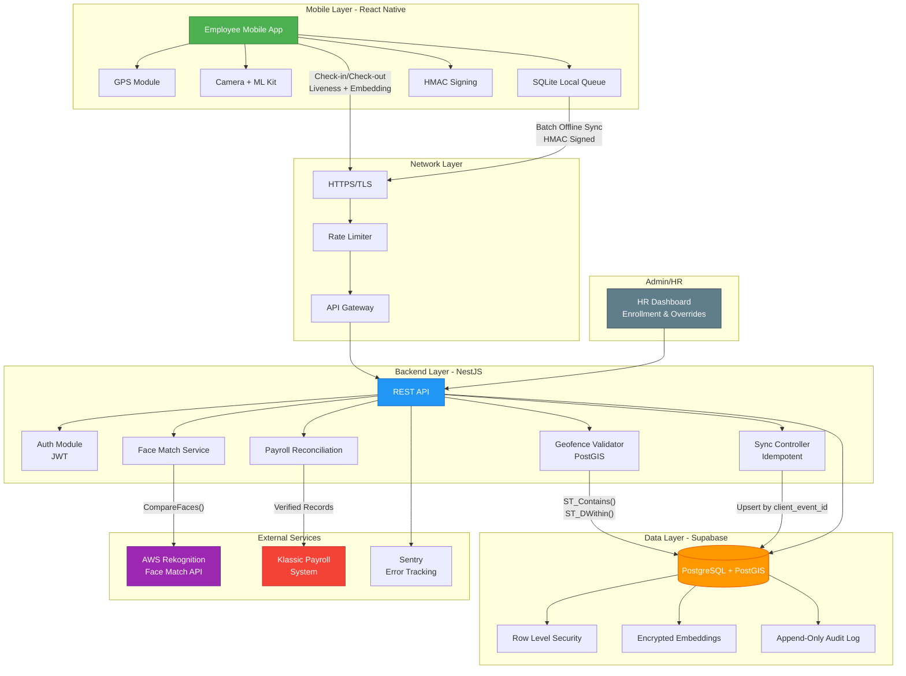
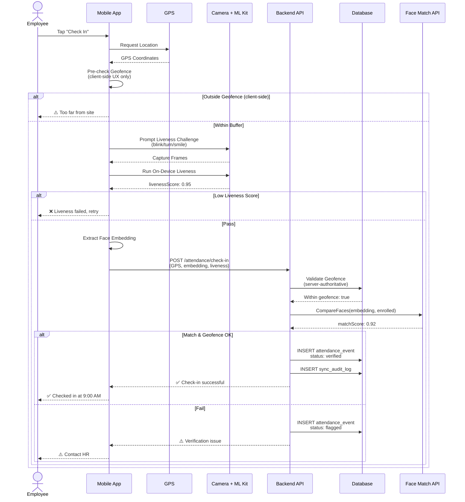
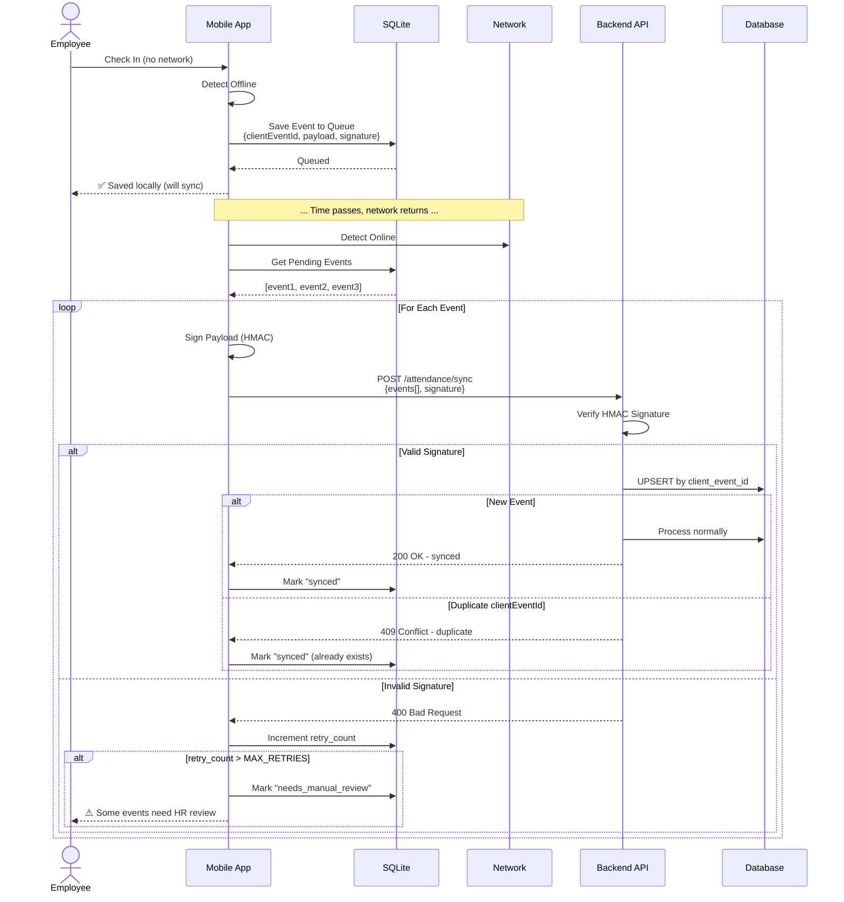
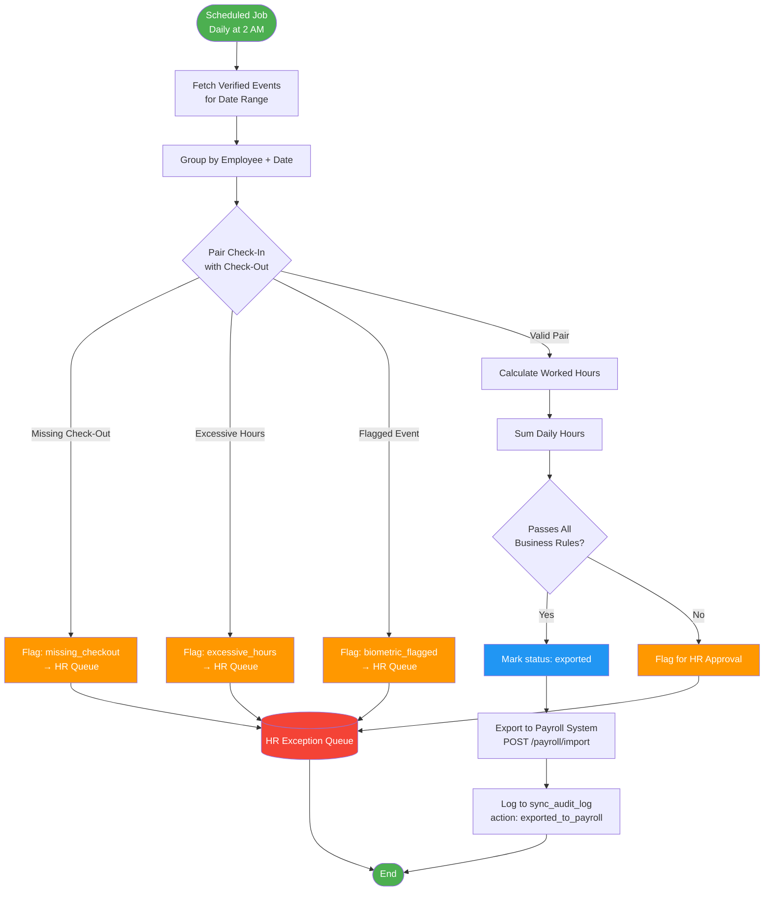
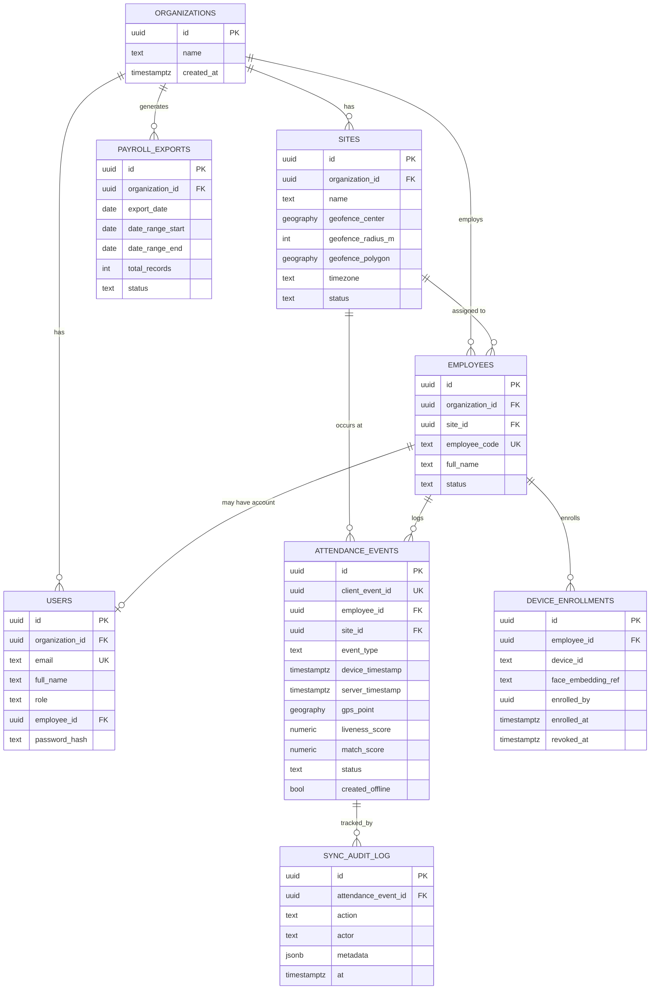

# Klassic Field Attendance System - Architecture

## System Architecture Diagram



---

## Component Flow Diagrams

### 1. Check-In Flow (Online)



---

### 2. Offline Sync Flow



---

### 3. Payroll Reconciliation Flow



---

## Data Flow: Geofence Validation

### Circular Geofence (Haversine Formula)

```
┌─────────────────────────────────────────┐
│  Site: SM Manila Office                  │
│  Center: (14.5964, 120.9842)            │
│  Radius: 100 meters                      │
└─────────────────────────────────────────┘
                    │
                    ▼
┌─────────────────────────────────────────┐
│  Employee Check-In Request              │
│  GPS: (14.5970, 120.9850)               │
└─────────────────────────────────────────┘
                    │
                    ▼
┌─────────────────────────────────────────┐
│  Backend: Calculate Distance             │
│  Formula: Haversine                      │
│  Distance = 87.3 meters                  │
└─────────────────────────────────────────┘
                    │
                    ▼
         ┌──────────┴──────────┐
         │                     │
         ▼                     ▼
    ✅ PASS                ❌ REJECT
  87.3m ≤ 100m          > 100m
  Status: verified      Status: flagged
```

### Polygon Geofence (PostGIS)

```sql
-- Server-side query (authoritative)
SELECT ST_Contains(
  geofence_polygon,
  ST_SetSRID(ST_MakePoint(:lng, :lat), 4326)
) AS is_within
FROM sites
WHERE id = :site_id;

-- Returns: true → verified, false → flagged
```

---

## Security Architecture

```mermaid
graph TB
    subgraph "Defense in Depth"
        L1[Layer 1: Network<br/>TLS 1.3, Rate Limiting]
        L2[Layer 2: Authentication<br/>JWT + Refresh Tokens]
        L3[Layer 3: Authorization<br/>RBAC + RLS]
        L4[Layer 4: Input Validation<br/>DTO Guards, Schema Validation]
        L5[Layer 5: Business Logic<br/>Server-side Geofence & Face Match]
        L6[Layer 6: Data<br/>Encryption at Rest, Audit Log]
        L7[Layer 7: Monitoring<br/>Sentry, Anomaly Detection]
    end
    
    L1 --> L2
    L2 --> L3
    L3 --> L4
    L4 --> L5
    L5 --> L6
    L6 --> L7
    
    style L1 fill:#F44336,color:#fff
    style L2 fill:#FF9800,color:#fff
    style L3 fill:#FFC107,color:#fff
    style L4 fill:#FFEB3B,color:#fff
    style L5 fill:#8BC34A,color:#fff
    style L6 fill:#4CAF50,color:#fff
    style L7 fill:#2196F3,color:#fff
```



---

## Database Schema (Entity Relationship)



---

## Technology Stack Deep Dive

### Backend: NestJS

**Why NestJS?**
- ✅ **Type Safety**: TypeScript end-to-end
- ✅ **Opinionated Structure**: Modules, Guards, Pipes, Interceptors prevent accidental security gaps
- ✅ **Built-in Validation**: class-validator + class-transformer for DTO validation
- ✅ **Dependency Injection**: Testable, modular architecture
- ✅ **Enterprise-Ready**: Used by large organizations for mission-critical systems

**Alternatives Considered:**
- ❌ Express.js: Too unopinionated for a payroll-adjacent system (easy to skip validation)
- ❌ Django/Flask: Would work, but team expertise is stronger in Node.js
- ❌ Golang: Excellent performance, but slower dev speed for MVP

### Database: PostgreSQL + PostGIS (via Supabase)

**Why PostgreSQL?**
- ✅ **ACID Transactions**: Critical for attendance → payroll data integrity
- ✅ **Relational Model**: Natural fit for employees, sites, events, exports
- ✅ **PostGIS Extension**: Native geospatial queries (ST_Contains, ST_DWithin)
- ✅ **Row Level Security**: Built-in multi-tenancy (org isolation at DB level)

**Why Supabase?**
- ✅ **Managed Postgres**: Auto-backups, point-in-time recovery, scaling
- ✅ **Built-in Auth**: JWT generation, refresh tokens
- ✅ **RLS Policies**: Declarative security (can't be bypassed by application bugs)
- ✅ **Real-time Subscriptions**: Future feature (live attendance dashboard)

**Alternatives Considered:**
- ❌ MongoDB: Weaker transactions, no native geospatial SQL syntax, less suitable for payroll math
- ❌ Firebase: Vendor lock-in, harder to export data, less control
- ❌ MySQL: No PostGIS equivalent, weaker JSON support

### Mobile: React Native (Expo Bare Workflow)

**Why React Native?**
- ✅ **Cross-Platform**: iOS + Android from one codebase
- ✅ **Native Module Support**: Required for facial recognition SDKs
- ✅ **TypeScript**: Shared types with backend
- ✅ **Large Ecosystem**: Libraries for GPS, camera, biometrics, offline storage

**Why Bare Workflow (not Expo Go)?**
- ✅ Liveness detection SDKs require native modules
- ✅ Root/jailbreak detection requires native code
- ✅ Custom ML Kit integration

**Alternatives Considered:**
- ❌ Native (Swift/Kotlin): 2x development time, 2x maintenance cost
- ❌ Flutter: Less mature ecosystem for biometric/ML libraries
- ❌ PWA: No reliable offline mode, can't access native biometric APIs

---

## Deployment Architecture

### Production Environment

```
┌──────────────────────────────────────────────────────────────┐
│                      CLOUDFLARE / DNS                          │
│                  api.klassic.ph (TLS/CDN)                      │
└────────────────────────────┬─────────────────────────────────┘
                             │
                             ▼
┌──────────────────────────────────────────────────────────────┐
│              RENDER / RAILWAY / FLY.IO                         │
│  ┌────────────────────────────────────────────────────────┐  │
│  │  Docker Container (NestJS API)                         │  │
│  │  - Auto-scaling (1-5 instances)                        │  │
│  │  - Health checks (/health)                             │  │
│  │  - Environment secrets from vault                      │  │
│  └────────────────────────────────────────────────────────┘  │
└────────────────────────────┬─────────────────────────────────┘
                             │
                ┌────────────┼────────────┐
                ▼            ▼            ▼
         ┌──────────┐  ┌──────────┐  ┌──────────┐
         │ Supabase │  │   AWS    │  │  Sentry  │
         │ Postgres │  │Rekognition│  │  Logs    │
         │ + PostGIS│  │Face Match │  │          │
         └──────────┘  └──────────┘  └──────────┘
                             │
                             ▼
                    ┌────────────────┐
                    │Klassic Payroll │
                    │     System     │
                    └────────────────┘
```

### CI/CD Pipeline (GitHub Actions)

```
┌──────────┐     ┌──────────┐     ┌──────────┐     ┌──────────┐
│  Push to │ --> │   Lint   │ --> │   Test   │ --> │  Build   │
│   main   │     │ (ESLint) │     │  (Jest)  │     │ (Docker) │
└──────────┘     └──────────┘     └──────────┘     └──────────┘
                                                           │
                                                           ▼
                                                    ┌──────────┐
                                                    │  Deploy  │
                                                    │ Staging  │
                                                    └──────────┘
                                                           │
                                                           ▼
                                                    ┌──────────┐
                                                    │  Manual  │
                                                    │ Approval │
                                                    └──────────┘
                                                           │
                                                           ▼
                                                    ┌──────────┐
                                                    │  Deploy  │
                                                    │Production│
                                                    └──────────┘
```

---

## Scalability Considerations

### Current Architecture Capacity

| Component | Expected Load | Capacity | Bottleneck |
|-----------|---------------|----------|------------|
| **API Server** | ~1000 concurrent users, 10K req/day | 10K req/sec (single instance) | CPU (face matching) |
| **Database** | 100K attendance events/day | 10M rows (no issue) | Write throughput at ~50K/sec |
| **Face Match API** | ~2K face comparisons/day | AWS: virtually unlimited | Cost, not capacity |
| **Mobile App** | Offline-first, no direct scaling concern | N/A | Device storage (~10K events) |

### Scaling Strategy (if needed)

1. **Horizontal Scaling**: Add more API instances (stateless, load-balanced)
2. **Read Replicas**: If reporting queries slow down writes
3. **Queue-Based Face Matching**: Offload face comparisons to a job queue (BullMQ + Redis)
4. **CDN for Static Assets**: Mobile app updates via CDN
5. **Database Sharding**: By organization_id (only if > 10M events/month)

---

## Disaster Recovery

### Backup Strategy

- **Database**: Supabase auto-backup (daily) + point-in-time recovery (7 days)
- **Application Code**: Git (GitHub) + Docker images (container registry)
- **Secrets**: Vault backups (encrypted)

### Recovery Time Objectives (RTO/RPO)

| Scenario | RTO (Recovery Time) | RPO (Data Loss) |
|----------|---------------------|-----------------|
| API server crash | < 5 minutes (auto-restart) | 0 (stateless) |
| Database corruption | < 1 hour (restore from backup) | < 24 hours (daily backup) |
| Complete infrastructure loss | < 4 hours (redeploy from scratch) | < 24 hours |

### Rollback Plan

```bash
# If production deployment breaks:

# 1. Revert to previous Docker image
docker pull klassic-attendance-api:v1.2.3-stable
docker stop klassic-attendance-api-current
docker run klassic-attendance-api:v1.2.3-stable

# 2. Revert database migration (if schema changed)
npm run migration:revert

# 3. Notify team + incident report
```

---

## Performance Benchmarks (Target)

| Endpoint | Target Response Time | Notes |
|----------|---------------------|-------|
| `POST /auth/login` | < 500ms | Includes password hashing (bcrypt) |
| `POST /attendance/check-in` | < 1s | Includes geofence calc + face match API call |
| `POST /attendance/sync` (10 events) | < 2s | Batch upsert |
| `GET /attendance/history` | < 300ms | Paginated query |
| `GET /payroll/export` | < 5s | For 1 month of data (~10K events) |

---

## Next Steps

See [README.md](../../README.md) for implementation roadmap (Phases 1-10).

---

**Document Version**: 1.0  
**Last Updated**: September 11, 2026  
**Author**: Klassic Engineering Team
